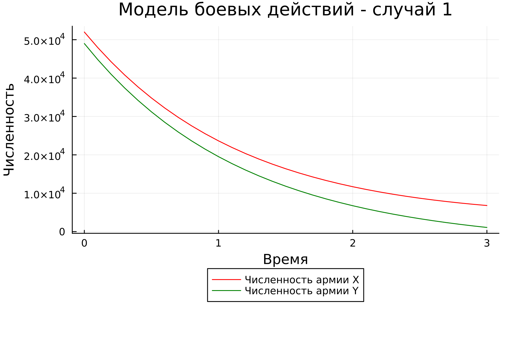
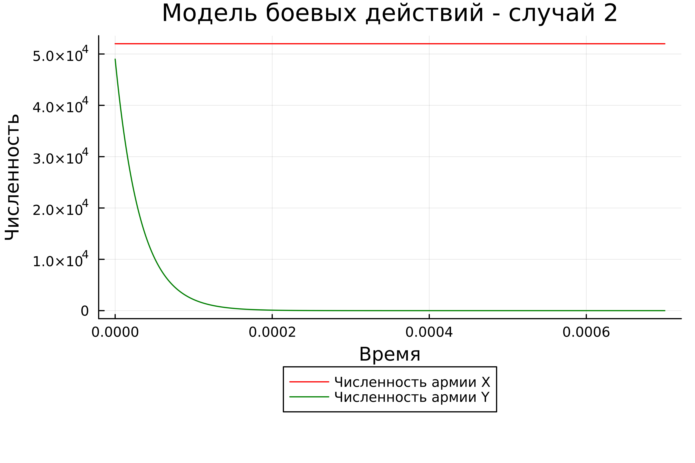

---
## Front matter
lang: ru-RU
title: Лабораторная работа №3
subtitle: Математическое моделирование
author:
  - Малашенко М. В.
institute:
  - Российский университет дружбы народов, Москва, Россия
date: 2023

## i18n babel
babel-lang: russian
babel-otherlangs: english

## Formatting pdf
toc: false
toc-title: Содержание
slide_level: 2
aspectratio: 169
section-titles: true
theme: metropolis
header-includes:
 - \metroset{progressbar=frametitle,sectionpage=progressbar,numbering=fraction}
 - '\makeatletter'
 - '\beamer@ignorenonframefalse'
 - '\makeatother'
---

## Докладчик

:::::::::::::: {.columns align=center}
::: {.column width="70%"}

  * Малашенко Марина Владимировна
  * Студентка группы НФИбд-01-20
  * Студ. билет 1032202459
  * Российский университет дружбы народов

:::
::: {.column width="30%"}

:::
::::::::::::::

## Цель лабораторной работы

- Изучить модели боевых действий Ланчестера. Применить их на практике для решения задания лабораторной работы. 

## Теоретическая справка (1)

Законы Ланчестера (законы Осипова — Ланчестера) — математическая формула для расчета относительных сил пары сражающихся сторон — подразделений вооруженных сил

*Уравнения Ланчестера — это дифференциальные уравнения, описывающие зависимость между силами сражающихся сторон A и D как функцию от времени, причем функция зависит только от A и D.*

## Теоретическая справка (2)

В 1916 году, в разгар первой мировой войны, Фредерик Ланчестер разработал систему дифференциальных уравнений для демонстрации соотношения между противостоящими силами. Среди них есть так называемые Линейные законы Ланчестера (первого рода или честного боя, для рукопашного боя или неприцельного огня) и Квадратичные законы Ланчестера (для войн начиная с XX века с применением прицельного огня, дальнобойных орудий, огнестрельного оружия). В связи с установленным приоритетом в англоязычной литературе наметилась тенденция перехода от фразы «модель Ланчестера» к «модели Осипова — Ланчестера». [4]

## Теоретическая справка (3)

- В противоборстве могут принимать участие как регулярные войска,
так и партизанские отряды. В общем случае главной характеристикой соперников
являются численности сторон. Если в какой-то момент времени одна из
численностей обращается в нуль, то данная сторона считается проигравшей (при
условии, что численность другой стороны в данный момент положительна)

## Теоретическая справка (4)

Рассмотривается три случая ведения боевых действий:

1. Боевые действия между регулярными войсками

2. Боевые действия с участием регулярных войск и партизанских отрядов

3. Боевые действия между партизанскими отрядами

## Задание лабораторной работы

Между страной Х и страной У идет война. Численность состава войск исчисляется от начала войны, и являются временными функциями $x(t)$ и $y(t)$. В
начальный момент времени страна Х имеет армию численностью $52 000$ человек, а в распоряжении страны У армия численностью в $49 000$ человек. Для упрощения модели считаем, что коэффициенты $a$, $b$, $c$, $h$ постоянны. Также считаем $P(t)$ и $Q(t)$ непрерывными функциями. 

## Задание лабораторной работы. Вариант 30

Постройте графики изменения численности войск армии Х и армии У для следующих случаев:

1. Модель боевых действий между регулярными войсками:

$$ {dx\over {dt}} = -0.36x(t)-0.48y(t)+sin(t+1)+1 $$
$$ {dy\over {dt}} = -0.49x(t)-0.37y(t)+cos(t+2)+1.1 $$

2. Модель ведение боевых действий с участием регулярных войск и партизанских отрядов:

$$ {dx\over {dt}} = -0.11x(t)-0.68y(t)+sin(5t) $$
$$ {dy\over {dt}} = -0.6x(t)y(t)-0.15y(t)+cos(5t) + 1 $$

## Задачи:

1. Построить модель боевых действий между регулярными войсками на языках Julia и OpenModelica

2. Построить модель ведения боевых действий с участием регулярных войск и
партизанских отрядов на языках Julia и OpenModelica

# Ход выполнения лабораторной работы

## Построение математической модели (1)

### Регулярная армия X против регулярной армии Y

Рассмотрим первый случай. 
Численность регулярных войск определяется тремя факторами:

1. Cкорость уменьшения численности войск из-за причин, не связанных с боевыми действиями (болезни, травмы, дезертирство);
2. Cкорость потерь, обусловленных боевыми действиями противоборствующих сторон (что связанно с качеством стратегии, уровнем вооружения, профессионализмом солдат и т.п.);
3. Cкорость поступления подкрепления (задаётся некоторой функцией от времени).

## Построение математической модели (1)

### Регулярная армия X против регулярной армии Y

В этом случае модель боевых действий между регулярными войсками описывается следующим образом:

$$ {dx\over {dt}} = -a(t)x(t)-b(t)y(t)+P(t) $$
$$ {dy\over {dt}} = -c(t)x(t)-h(t)y(t)+Q(t) $$

В первом пункте нами рассматривается как раз такая модель. Она является доработанной моделью Ланчестера, так его изначальная модель учитывала лишь члены $b(t)y(t)$ и $c(t)x(t)$, то есть, на потери за промежуток времени влияли лишь численность армий и "эффективность оружия" (коэффициенты $b(t)$ и $c(t)$).

## Построение математической модели (1)

### Регулярная армия X против регулярной армии Y

$$ {dx\over {dt}} = -ax(t)-by(t)+P(t) $$
$$ {dy\over {dt}} = -cx(t)-hy(t)+Q(t) $$

Именно эти уравнения [3] и будут решать наши программы для выполнения первой части задания. В конце мы получим график кривой в декартовых координатах, где по оси $ox$ будет отображаться численность армии государства X, по оси $ox$ будет отображаться соответствующая численность армии Y. По тому, с какой осью пересечётся график, можно определить исход войны. Если ось $ox$ будет пересечена в положительных значениях, победа будет на стороне армии государства X (так как при таком раскладе численность армии Y достигла нуля при положительном значении численности армии X). Аналогичная ситуация для оси $oy$ и победы армии государства Y. 

## Построение математической модели (2)

### Регулярная армия X против партизанской армии Y

Для второй части задания, то есть, для моделирования боевых действий между регулярной армией и партизанской армией, необходимо внести поправки в предыдущую модель. Считается, что темп потерь партизан, проводящих свои операции в разных местах на некоторой известной территории, пропорционален не только численности армейских соединений, но и численности самих партизан.

## Построение математической модели (2)

$$ {dx\over {dt}} = -a(t)x(t)-b(t)y(t)+P(t) $$
$$ {dy\over {dt}} = -c(t)x(t)y(t)-h(t)y(t)+Q(t) $$

Коэффициенты $a$, $b$, $c$ и $h$ всё так же будут положительными десятичными числами:

$$ {dx\over {dt}} = -ax(t)-by(t)+P(t) $$
$$ {dy\over {dt}} = -cx(t)y(t)-hy(t)+Q(t) $$

# Решение с помощью программ

## Результаты работы кода на Julia

На рис. @fig:002 и @fig:003 изображены итоговые графики для обоих случаев.

{#fig:002}

## Результаты работы кода на Julia

На рис. @fig:002 и @fig:003 изображены итоговые графики для обоих случаев.

{#fig:003}

## OpenModelica

Откроем OpenModelica:

{#fig:005}

## Результаты работы кода на OpenModelica

На графиках на рис. @fig:006 и @fig:007, построенных с помощью OpenModelica изображены графики, аналогичные графикам @fig:002 и @fig:003 соответственно.

{#fig:006}

## Результаты работы кода на OpenModelica

На графиках на рис. @fig:006 и @fig:007, построенных с помощью OpenModelica изображены графики, аналогичные графикам @fig:002 и @fig:003 соответственно.

{#fig:007}

## Анализ полученных результатов

Как видно из графиков, для первой модели, то есть двух регулярных армий, противостоящих друг другу, графики на Julia и OpenModelica идентичны (с поправкой на использование разных графических ресурсов, разный масштаб и т.д.).

Аналогичная ситуация верна и для графиков противостояния регулярной армии армии партизанов, которые рассматривались во второй модели.

# Вывод

## Вывод

По итогам лабораторной работы я построила по две модели на языках Julia и OpenModelica. В ходе проделанной работы можно сделать вывод, что OpenModelica лучше приспособлен для моделирование процессов, протекающих во времени. Построение моделей боевых действий на языке OpenModelica занимает гораздо меньше строк и времени, чем аналогичное построение на языке Julia.

## Список литературы. Библиография

[1] Документация по Julia: https://docs.julialang.org/en/v1/

[2] Документация по OpenModelica: https://openmodelica.org/

[3] Решение дифференциальных уравнений: https://www.wolframalpha.com/

[4] Законы Ланчестера: https://ru.wikipedia.org/wiki/%D0%97%D0%B0%D0%BA%D0%BE%D0%BD%D1%8B_%D0%9E%D1%81%D0%B8%D0%BF%D0%BE%D0%B2%D0%B0_%E2%80%94_%D0%9B%D0%B0%D0%BD%D1%87%D0%B5%D1%81%D1%82%D0%B5%D1%80%D0%B0