---
## Front matter
title: "Отчёт по лабораторной работе №1

Математическое моделирование"
subtitle: "Настройка рабочего пространства. Система контроля версий Git. Язык разметки Markdown"
author: "Выполнила: Малашенко Марина Владимировна, 

НФИбд-01-20, 1032202459"

## Generic otions
lang: ru-RU
toc-title: "Содержание"

## Bibliography
bibliography: bib/cite.bib
csl: pandoc/csl/gost-r-7-0-5-2008-numeric.csl

## Pdf output format
toc: true # Table of contents
toc-depth: 2
lof: true # List of figures
fontsize: 12pt
linestretch: 1.5
papersize: a4
documentclass: scrreprt
## I18n polyglossia
polyglossia-lang:
  name: russian
  options:
	- spelling=modern
	- babelshorthands=true
polyglossia-otherlangs:
  name: english
## I18n babel
babel-lang: russian
babel-otherlangs: english
## Fonts
mainfont: PT Serif
romanfont: PT Serif
sansfont: PT Sans
monofont: PT Mono
mainfontoptions: Ligatures=TeX
romanfontoptions: Ligatures=TeX
sansfontoptions: Ligatures=TeX,Scale=MatchLowercase
monofontoptions: Scale=MatchLowercase,Scale=0.9
## Biblatex
biblatex: true
biblio-style: "gost-numeric"
biblatexoptions:
  - parentracker=true
  - backend=biber
  - hyperref=auto
  - language=auto
  - autolang=other*
  - citestyle=gost-numeric
## Pandoc-crossref LaTeX customization
figureTitle: "Рис."
tableTitle: "Таблица"
listingTitle: "Листинг"
lofTitle: "Список иллюстраций"
lolTitle: "Листинги"
## Misc options
indent: true
header-includes:
  - \usepackage{indentfirst}
  - \usepackage{float} # keep figures where there are in the text
  - \floatplacement{figure}{H} # keep figures where there are in the text
---

# Цель работы

Настроить рабочее пространство для лабораторной работы. Изучить систему контроля версий Git и язык разметки Markdown.

# Задание

Создать директорию, создать репозиторий, настроить связь между своим компьютером и GitHub по SSH-ключу. При помощи Makefile сконвертировать из файла .md файлы отчетов в форматах docx и pdf. Запушить все готовые отчеты на Github.

# Теоретическое введение

Git — система управления версиями с распределенной архитектурой. В отличие от некогда популярных систем вроде CVS и Subversion (SVN), где полная история версий проекта доступна лишь в одном месте, в Git каждая рабочая копия кода сама по себе является репозиторием. Это позволяет всем разработчикам хранить историю изменений в полном объеме.

Markdown — облегчённый язык разметки, созданный с целью обозначения форматирования в простом тексте, с максимальным сохранением его читаемости человеком, и пригодный для машинного преобразования в языки для продвинутых публикаций (HTML, Rich Text и других). 

| Название команды | Описание команды                                                                                                         |
|--------------|----------------------------------------------------------------------------------------------------------------------------|
| `git clone`          | Клонирование репозитория на ПК                                                                              |
| `git commit -m "Initial Commit"`      | Оставление коммита    |
| `git push`       | Загрузка изменений на гит                       |
| `make`      | Конвертация файла .md |

 

# Выполнение лабораторной работы

**1.** Создадим директорию на своем компьютере по шаблону:

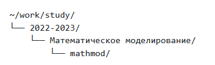

(рис. 1.  Шаблон директории)

**2.** Авторизируемся на Github:

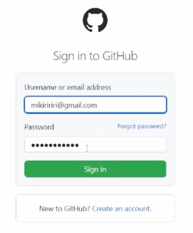

(рис. 2.  Авторизация)

**3.** Перейдем к шаблону репозитория и создадим по нему свой новый репозиторий:

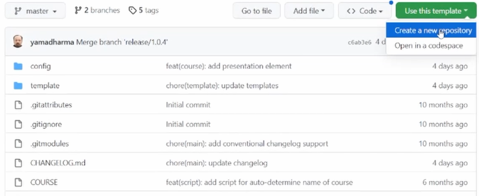

(рис. 3.  Шаблон репозитория)

**4.** Создадим и настроим репозиторий:

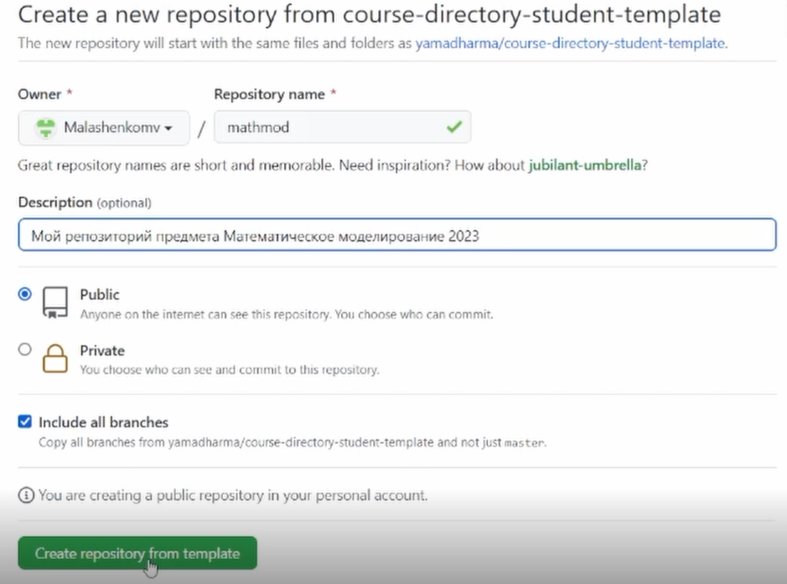

(рис. 4.  Создание репозитория)

**5.** Установим make:

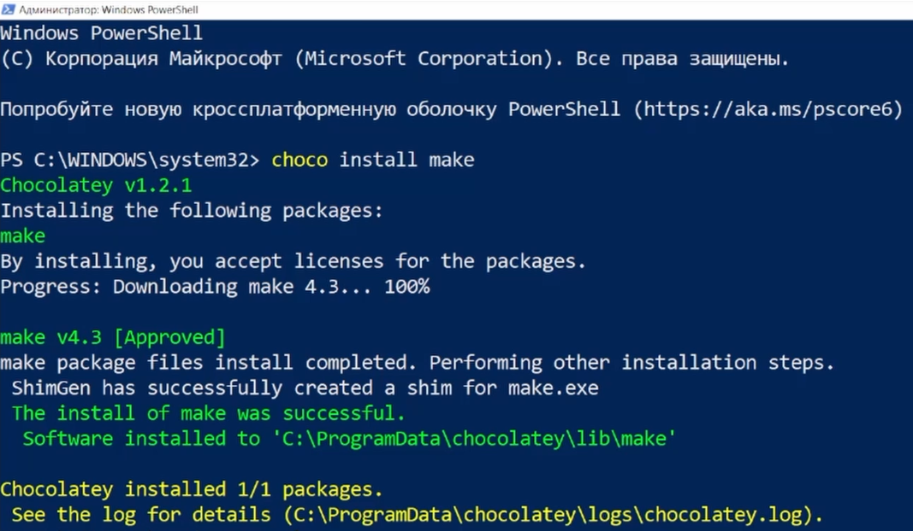

(рис. 5. Установка make)

**6.** Установим git:

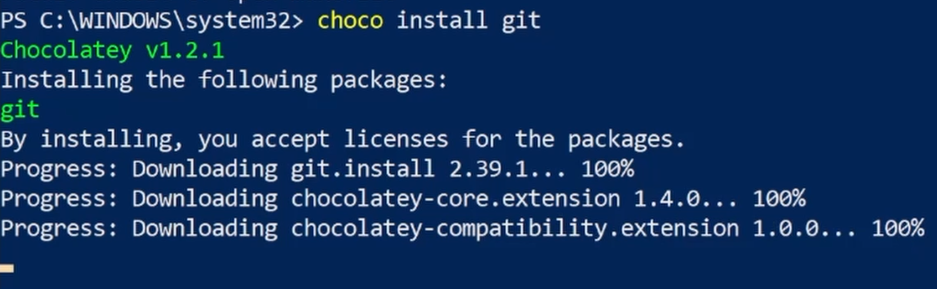

(рис. 6. Установка git)

**7.** Запросим SSH-ключ:

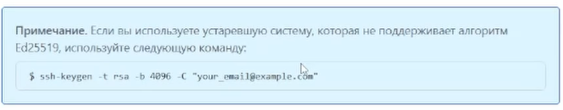

(рис. 7. Запрос ключа)

**8.** Получим SSH-ключ:

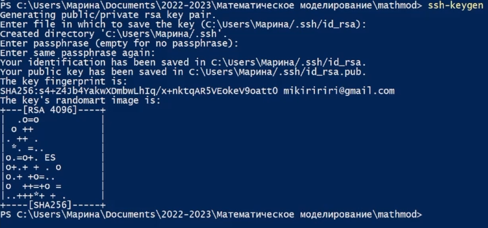

(рис. 8. Получение ключа)

**9.** Получим id SSH-ключа:

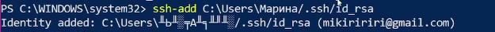

(рис. 9. Получение id ключа)

**10.** Добавим связку по SSH-ключу на сайт:

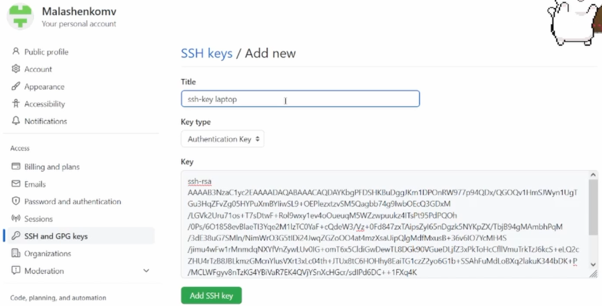

(рис. 10. Добавление ключа)

**11.** Клонируем репозиторий:

`git clone --recursive git@github.com:malashenkomv/mathmod` 

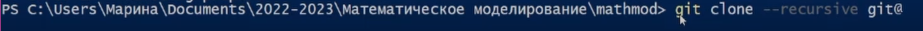

(рис. 11. Клонирование)

**12.** Репозиторий склонирован:

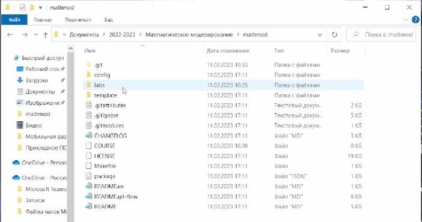

(рис. 12. Репозиторий в директории)

Создадим папку Labs с внутренней папкой Lab01. Внутри папки Lab01 папки report и presentation.

**13.** Вид папки Lab01/report:

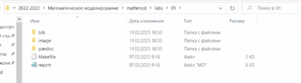

(рис. 13. Папка лабораторной работы)

**14.** Конвертируем .md файл в docx командой make:

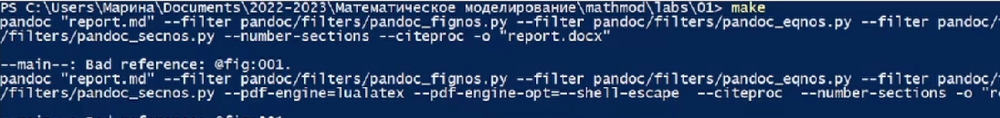

(рис. 14. Конвертация в docx)

**15.** Получили docx файл:

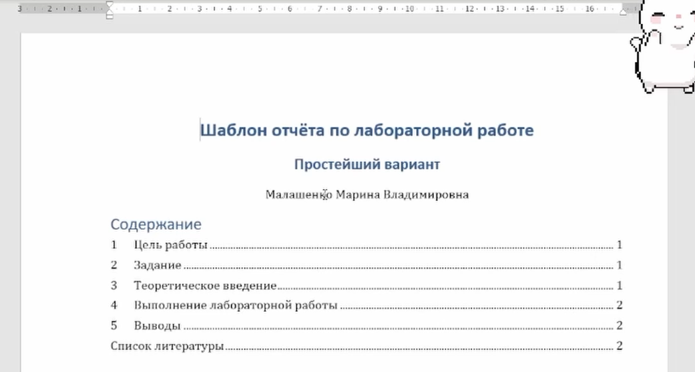

(рис. 15. Полученный docx)

**16.** Для конвертации .md файла в pdf потребуется установка TeX Live.Установим MiKTeX как альтернативу TeX Live для LaTeX:

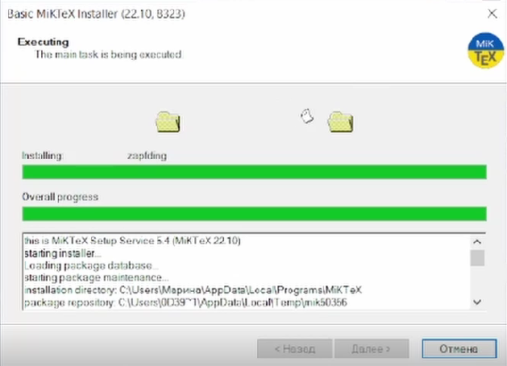

(рис. 16. MiKTeX)

**17.** Конвертируем .md файл в pdf командой:

`pandoc report.md -o report.pdf --pdf-engine=lualatex -V mainfont="Times New Roman" -V sansfont="DejaVu Sans" -V monofont="DejaVu Sans Mono"` 

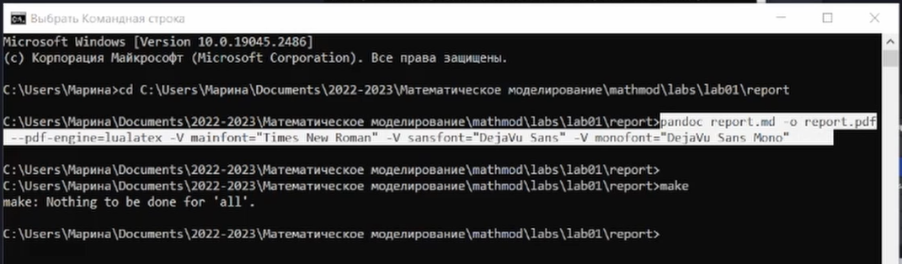

(рис. 17. Конвертация в pdf)

**18.** Получили pdf файл:

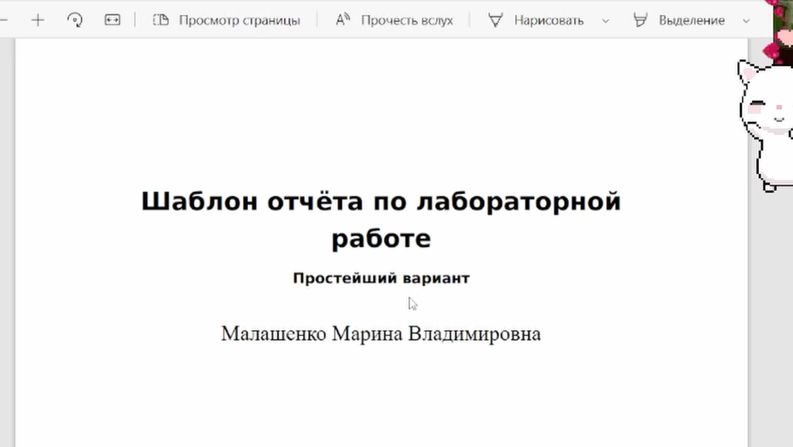

(рис. 18. Полученный pdf)

**19.** Итоговый вид папки отчета лабораторной работы:

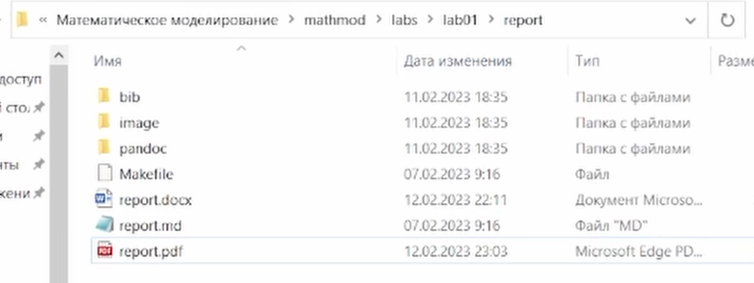

(рис. 19. Папка отчета лабораторной работы)

**20.** Конвертируем .md файл презентации в pdf презентации командой:

`pandoc presentation.md -o presentation.pdf —-pdf-engine=lualatex -V mainfont="Times New Roman" -V sansfont="DejaVu Sans" -V monofont="DejaVu Sans Mono" -t beamer —-slide-level=2` 

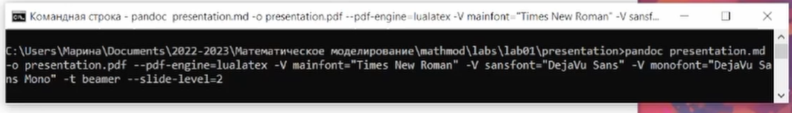

(рис. 20. Конвертация презентации)

**21.** Получили pdf файл презентации:

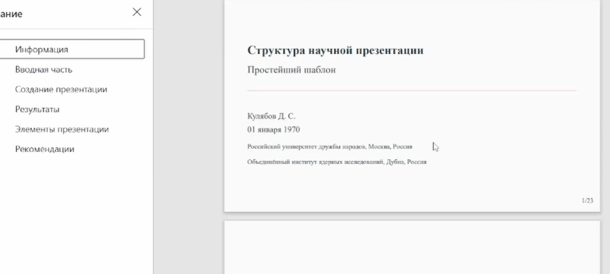

(рис. 21. Полученный pdf презентации)

# Вывод

Мы настроили рабочее пространство для лабораторной работы. Изучили систему контроля версий Git и язык разметки Markdown.

# Список литературы. Библиография

- Документация по Git: https://git-scm.com/book/ru/v2

- Документация по Markdown: https://learn.microsoft.com/ru-ru/contribute/markdown-reference

- Документация по MiKTeX: https://kpfu.ru/staff_files/F2077692752/Inst_MiKTeX.pdf

